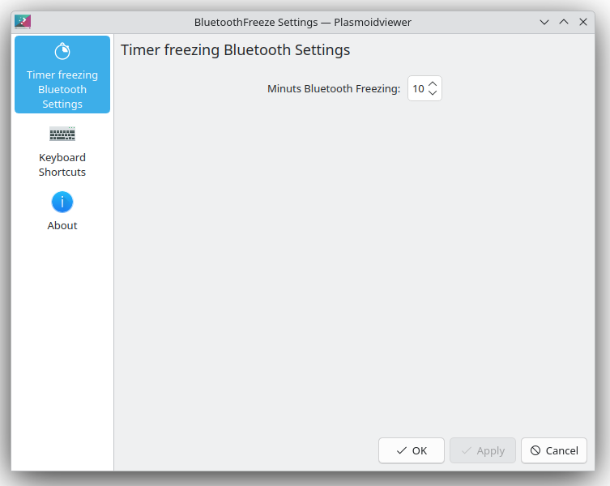

[English README.md](README.md)

# BluetoothFreeze

BluetoothFreeze — это плагин для KDE 6, который воспроизводит (не слышимый) звук с заданным интервалом, чтобы предотвратить сон у устройств Bluetooth.

## Основные возможности

- Воспроизводит звук с заданным интервалом, чтобы удерживать устройства Bluetooth в активном состоянии.
- Совместим с KDE 6.

## Скриншоты

Ниже приведены несколько скриншотов, которые демонстрируют пользовательский интерфейс проекта:

### Выключенная замарозка bluetooth

### Включенная замарозка bluetooth

### Настройка интервала между воспроизведением тихого звука для удержания соединения bluetooth

## Установка

Чтобы использовать плагин BluetoothFreeze, выполните следующие шаги:

1. Убедитесь, что у вас установлен KDE 6. И доступнка команда `paplay` в системе. Использует систему воспроизведения pulseaudio
2. Скачайте плагин BluetoothFreeze из репозитория проекта или соберите его из исходного кода.
3. Установите плагин, скопировав файлы в соответствующую директорию KDE плагина.
4. Настройте параметры плагина, указав желаемый интервал и звуковой файл.

## Конфигурация

Параметры плагина можно настроить, указав желаемый интервал и звуковой файл. Чтобы получить доступ к параметрам плагина, выполните следующие шаги:

1. Откройте системные настройки KDE.
2. Перейдите к плагину "BluetoothFreeze".
3. Настройте желаемый интервал

## Лицензия

Проект лицензирован на условиях [MIT License](LICENSE.md).

